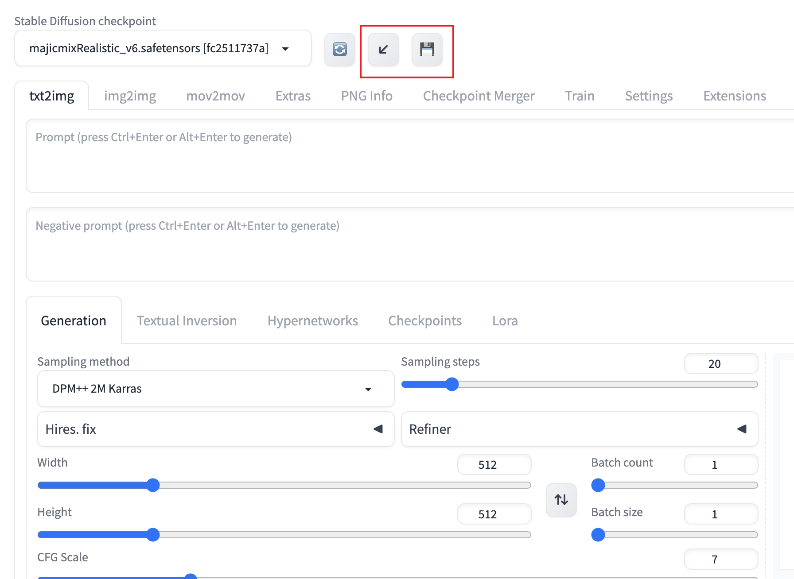

# sd-webui-workspace

[🇺🇸 English](README.md) | [🇨🇳 简体中文](README_CN.md) 

SD-WebUI Workflow is an expansion based on  [stable-diffusion-webui](https://github.com/AUTOMATIC1111/stable-diffusion-webui),designed to safeguard and rejuvenate your WebUI workspace. It affords a swift safeguarding of your current webui interface and revives it upon subsequent utilization.

> Should you find this extension beneficial, please bestow a star upon me on GitHub!

## Table of Contents

- [sd-webui-workspace](#sd-webui-workspace)
  - [Table of Contents](#table-of-contents)
  - [Features](#features)
  - [Installation](#installation)
  - [Cautions](#cautions)

## Features

- [X] Manually safeguard and restore workspace
- [X] Theoretically supports all extensions
- [X] Accommodates all inputtable elements
- [ ] Automatically safeguard and restore workspace
- [ ] Image component’s mask drawing

## Installation

1. Navigate to the Extensions tab.
2. Opt for 'Install from URL'.
3. Input into the designated field for the extension’s git repository URL: `https://github.com/Scholar01/sd-webui-workspace.git`
4. Click 'Install'.
5. Reboot WebUI.

Alternatively, directly seek and install `sd-webui-workspace` within webui-Extensions.

## Cautions

Should you encounter an unsupported extension, verify whether the `elem_id` attribute has been established for the extension's components. If absent, it is advisable to propose this addition to the author of the extension.

