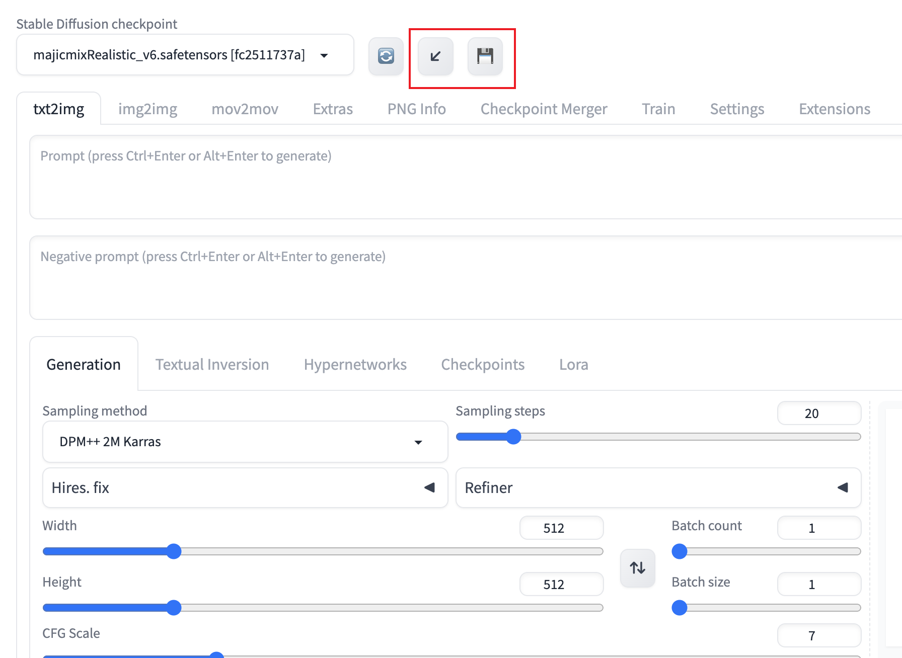

# sd-webui-workspace

[🇺🇸 English](README.MD) | [🇨🇳 简体中文](README_CN.MD) 

sd-webui-workflow 是一个基于 [stable-diffusion-webui](https://github.com/AUTOMATIC1111/stable-diffusion-webui)
的扩展，旨在保存和恢复Webui工作区.它可以快速保存当前您的webui界面,并在下次使用的时候恢复.

> 如果你觉得这个扩展有帮助，请在Github上给我一颗星！

## 目录

- [sd-webui-workspace](#sd-webui-workspace)
  - [目录](#目录)
  - [特性](#特性)
  - [安装方法](#安装方法)
  - [注意事项](#注意事项)

## 特性

- [X] 手动保存和恢复工作区
- [X] 理论上支持所有的扩展
- [X] 支持所有可输入的元素
- [ ] 自动保存和恢复工作区
- [ ] 图片组件的蒙版绘制

## 安装方法

1. 打开扩展（Extension）标签。
2. 点击从网址安装（Install from URL）
3. 在扩展的 git 仓库网址（URL for extension's git repository）处输入 `https://github.com/Scholar01/sd-webui-workspace.git`
4. 点击安装（Install）
5. 重启 WebUI

您还可以直接在webui-Extensions中搜索`sd-webui-workspace`并安装.

## 注意事项

如果您发现某个不支持的扩展,请检查该扩展的组件是否设置了`elem_id`属性.如果没有,请向该扩展的作者提出建议.

